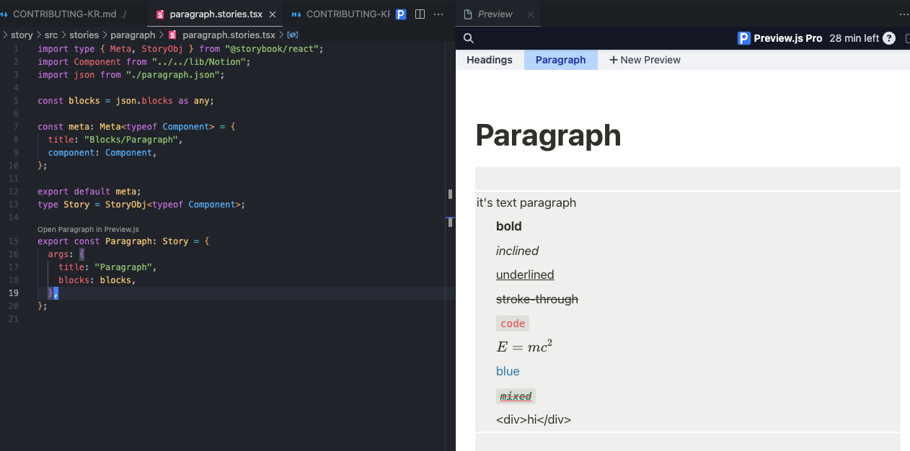

# Contributing Guide

## 目录

1. 介绍
   - 1.1 项目概述
   - 1.2 我们项目的独特之处
   - 1.3 项目结构
2. 贡献指南
   - 2.1 贡献流程
   - 2.2 PR 审批流程
   - 2.3 维护者与贡献者的角色
   - 2.4 发生问题(Issue) 和 PR 管理
3. 开发环境及指南
   - 3.1 开发环境设置
   - 3.2 PreviewJS 设置方法
   - 3.3 组件开发指南
4. 项目路线图
5. 项目结构说明

## 1. 介绍

感谢您对 react-notion-custom 项目的关注！

我们的目标是将 Notion 强大的内容管理功能与 React 灵活的 UI 实现能力相结合，让开发者可以轻松构建基于 Notion 的自定义博客或网站。

```jsx
<Notion>
  <Notion.Cover src={content.cover} />
  <Notion.Body>
    <Notion.Title title={content.title} />
    <Notion.Blocks blocks={content.blocks} />
  </Notion.Body>
</Notion>
```

### 我们项目的独特之处

react-notion-custom 通过以下特点与其他类似的库区别开来：

1. **使用 Notion 官方 API**：我们直接利用 Notion 官方 API，从而支持更稳定、最新的功能。

2. **最大化的自定义自由度**：为开发者提供最大程度的自由，能够根据需要修改组件和更改样式。

3. **高质量的 Notion 组件**：我们提供的高质量组件几乎与实际的 Notion 一致，让用户轻松实现熟悉且专业的 UI。

4. **性能优化**：通过高效的渲染和数据管理，能够快速加载和显示大规模的 Notion 页面。

凭借这些特点，react-notion-custom 将成为开发者结合 Notion 强大功能与 React 灵活性的最佳工具。

### 项目结构

```
react-notion-custom/
├── packages/
│   ├── react-notion-custom/
│   ├── notion-dump/
│   ├── docs/
│   └── story/
├── README.md
└── CONTRIBUTING.md
```

- `react-notion-custom`: 核心库，使用 Notion API 将 Notion 页面渲染为 React 组件。
- `notion-dump`: CLI 工具，用于提取 Notion 页面的数据并保存为 JSON 文件。
- `docs`: 包含项目文档和示例的网站。
- `story`: 使用 Storybook 进行 UI 组件测试和文档编写。

### 初始设置

要开始项目，在根目录运行以下命令：

```
npm install
```

## 2. 贡献指南

### 2.1 贡献流程

1. Fork 项目。
2. Clone 到本地(local)：`git clone <https://github.com/YOUR_USERNAME/react-notion-custom.git`>
3. 安装依赖：`npm install`
4. 创建新分支：`git checkout -b feature/your-feature-name`
   - 分支名称以 `feature/`、`fix/`、`docs/` 等开始，并添加简短说明。
5. 提交更改：`git commit -m "Add some feature"`
6. 推(Push) 到 Fork 的仓库：`git push origin feature/your-feature-name`
7. 创建 Pull Request (拉取请求)。

如果在PR (拉取请求)标题中添加 `[DRAFT]`，可以请求中期审查或代码审阅。

### 2.2 PR 审批流程

所有 Pull Request (拉取请求) 需要由项目维护者 “Moon-DaeSeung” 批准。
PR 请使用英语撰写。

### 2.3 维护者与贡献者的角色

- 维护者：负责决定项目方向并进行代码审查。
- 贡献者：可以参与修复错误、提出和实现新功能、改进文档等。

### 2.4 发生问题(Issue) 和 PR 管理

- 维护者和贡献者可以自由创建和解决问题。
- 维护者需要按功能分支来请求 PR。
- 禁止直接向推(Push) main 分支。

## 3. 开发环境及指南

### 3.1 开发环境设置

1. 确保已安装 Node.js 和 npm。
2. Clone 项目后，在根目录运行 `npm install` 安装所有依赖。

### 3.2 PreviewJS 设置方法

PreviewJS 能够在编辑器内直接预览 Storybook，开发体验更为便利。

1. 在 VSCode 中安装 [PreviewJS](https://previewjs.com/) 扩展程序。
2. 打开项目，并在每个 Story 代码中选择 “Open Preview”。



### 3.3 组件开发指南

开发 react-notion-custom 组件时，请遵循以下指南：

1. 使用 Storybook 进行开发：

   - 为每个组件编写 Story，并通过 Storybook 测试组件的不同状态和 props。
   - 可以通过在根目录运行 `npm run story:start` 来启动 Storybook。

2. 使用 PreviewJS：

   - 在 VSCode 中使用 PreviewJS 可以在编辑器中直接预览 Storybook，开发效率更高。

3. 组件命名与结构：

   - 组件名称请使用 PascalCase。
   - 每个组件文件名和文件夹名使用小写字母，单词间用横杠（-）分隔。(kebab-Case)

## 4. 项目路线图

### 1. 开发并发布 react-notion-custom 库

### 2. 开发并发布 notion-dump CLI 工具

### 3. 开发 docs 项目

- 编写项目介绍页面
  - 包含使用 NextJS 编写博客的示例
- 编写详细的使用指南和 API 文档
- 运营项目博客
  - 定期更新和共享 changelog

每个阶段的进展情况和详细内容可以在 问题跟踪系统(Issue Tracker) 中查看。

## 5. 项目结构说明

### react-notion-custom 和 notion-dump 的角色

1. **notion-dump**：

   - 使用 Notion API 获取指定 Notion 页面的内容。
   - 将获取的数据转换为 JSON 格式并保存到本地(local)。
   - 通过此过程，能够轻松分析和使用 Notion 页面的结构和内容。

2. **react-notion-custom**：
   - 接受 notion-dump 生成的 JSON 数据作为输入。
   - 解析 JSON 数据并转换为对应的 React 组件。
   - 提供与 Notion 各个块类型（文本、图片、表格等）对应的 React 组件。
   - 用户可以自定义这些组件，添加所需的样式和功能。

### 流程图示

以下是通过 react-notion-custom 渲染 Notion 页面的过程的 ASCII 图示：

```
+-------------+     +-------------+     +-------------------+
|   Notion    |     | notion-dump |     | react-notion-custom |
|   Page      | --> |   (CLI)     | --> |    (Library)      |
+-------------+     +-------------+     +-------------------+
      |                    |                      |
      |                    |                      |
      v                    v                      v
 +---------+        +-----------+         +----------------+
 | Content |        |   JSON    |         | React Components |
 | • Text  |        | {         |         | <NotionPage>   |
 | • Image | -----> |   "blocks"|  -----> | <TextBlock>    |
 | • Table |        |   ...     |         | <ImageBlock>   |
 | • ...   |        | }         |         | ...            |
 +---------+        +-----------+         +----------------+
                                                  |
                                                  |
                                                  v
                                          +--------------+
                                          | Rendered Page |
                                          | (Customizable)|
                                          +--------------+

```

通过此过程，用户可以直接将 Notion 页面的内容导入并在 React 应用中进行渲染，同时根据需求自定义样式和功能。

---

各子项目的贡献指南：

- [react-notion-custom 贡献方法](https://www.notion.so/packages/react-notion-custom/CONTRIBUTING-KR.md)
  - React 组件开发、Notion API 集成、性能优化等
- [notion-dump 贡献方法](https://www.notion.so/packages/notion-dump/CONTRIBUTING-KR.md)
  - CLI 工具开发、Notion 数据提取与转换逻辑改进等
- [文档贡献方法](https://www.notion.so/packages/docs/CONTRIBUTING-KR.md)
  - 文档编写、示例代码改进、多语言支持等

详细的贡献方法请参考相应的链接。
