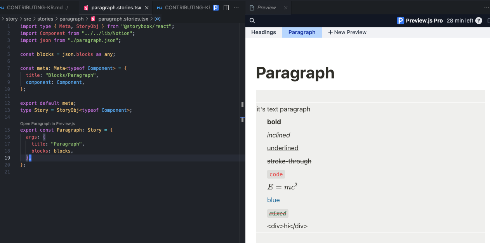

# Contributing Guide

## 목차

1. 소개
   - 1.1 프로젝트 개요
   - 1.2 우리 프로젝트의 특별한 점
   - 1.3 프로젝트 구조
2. 기여 가이드라인
   - 2.1 기여 프로세스
   - 2.2 PR 승인 프로세스
   - 2.3 메인테이너와 컨트리뷰터의 역할
   - 2.4 이슈 및 PR 관리
3. 개발 환경 및 가이드라인
   - 3.1 개발 환경 설정
   - 3.2 PreviewJS 설정 방법
   - 3.3 컴포넌트 개발 가이드라인
4. 프로젝트 로드맵
5. 프로젝트 구조 설명

## 1. 소개

react-notion-custom 프로젝트에 관심을 가져주셔서 감사합니다!

우리의 목표는 Notion의 강력한 콘텐츠 관리 기능과 React의 유연한 UI 구현 능력을 결합하여, 개발자들이 쉽게 Notion 기반의 커스텀 블로그나 웹사이트를 만들 수 있게 하는 것입니다.

```jsx
<Notion>
  <Notion.Cover src={content.cover} />
  <Notion.Body>
    <Notion.Title title={content.title} />
    <Notion.Blocks blocks={content.blocks} />
  </Notion.Body>
</Notion>
```

### 우리 프로젝트의 특별한 점

react-notion-custom은 다음과 같은 특징으로 다른 유사 라이브러리들과 차별화됩니다:

1. **Notion 공식 API 사용**: 우리는 Notion의 공식 API를 직접 활용합니다. 이를 통해 더 안정적이고 최신의 기능들을 지원할 수 있습니다.

2. **최대한의 커스텀 자유도**: 개발자들에게 최대한의 자유를 제공합니다. 원하는 대로 컴포넌트를 수정하고 스타일을 변경할 수 있습니다.

3. **고수준의 Notion 컴포넌트**: 우리는 실제 Notion과 거의 동일하게 보이는 고품질의 컴포넌트를 제공합니다. 이를 통해 사용자들에게 친숙하고 전문적인 느낌의 UI를 쉽게 구현할 수 있습니다.

4. **성능 최적화**: 효율적인 렌더링과 데이터 관리를 통해 대규모 Notion 페이지도 빠르게 로드하고 표시할 수 있습니다.

이러한 특징들을 통해, react-notion-custom은 개발자들에게 Notion의 강력함과 React의 유연성을 모두 제공하는 최고의 도구가 될 것입니다.

### 프로젝트 구조

```
react-notion-custom/
├── packages/
│   ├── react-notion-custom/
│   ├── notion-dump/
│   ├── docs/
│   └── story/
├── README.md
└── CONTRIBUTING.md
```

- `react-notion-custom`: Notion API를 활용해 Notion 페이지를 React 컴포넌트로 렌더링하는 핵심 라이브러리
- `notion-dump`: Notion 페이지의 데이터를 추출하여 JSON 파일로 저장하는 CLI 도구
- `docs`: 프로젝트 문서 및 예제를 포함한 웹사이트
- `story`: Storybook을 이용한 UI 컴포넌트 테스트 및 문서화

### 초기 설정

프로젝트를 시작하려면 루트 디렉토리에서 다음 명령어를 실행하세요:

```
npm install
```

## 2. 기여 가이드라인

### 2.1 기여 프로세스

1. 프로젝트를 Fork합니다.
2. 로컬에 Clone합니다: `git clone https://github.com/YOUR_USERNAME/react-notion-custom.git`
3. 의존성을 설치합니다: `npm install`
4. 새로운 브랜치를 생성합니다: `git checkout -b feature/your-feature-name`
   - 브랜치 이름은 `feature/`, `fix/`, `docs/` 등으로 시작하고 간단한 설명을 추가합니다.
5. 변경사항을 커밋합니다: `git commit -m "Add some feature"`
6. Fork한 저장소에 Push합니다: `git push origin feature/your-feature-name`
7. Pull Request를 생성합니다.

PR 제목에 `[DRAFT]`를 추가하면 작업 중 중간 검토나 리뷰를 요청할 수 있습니다.

### 2.2 PR 승인 프로세스

모든 Pull Request는 프로젝트 메인테이너 Moon-DaeSeung의 승인이 필요합니다.
PR은 모두 영어로 작성해주시요.

### 2.3 메인테이너와 컨트리뷰터의 역할

- 메인테이너: 프로젝트의 방향성을 결정하고 코드 리뷰를 담당합니다.
- 컨트리뷰터: 버그 수정, 새로운 기능 제안 및 구현, 문서 개선 등에 참여할 수 있습니다.

### 2.4 이슈 및 PR 관리

- 메인테이너와 컨트리뷰터 모두 자유롭게 이슈를 생성하고 해결할 수 있습니다.
- 메인테이너는 기능별로 브랜치를 분리하여 PR을 요청해야 합니다.
- main 브랜치에 직접 push하는 것은 금지됩니다.

## 3. 개발 환경 및 가이드라인

### 3.1 개발 환경 설정

1. mise 설치:

   - mise는 polyglot development environment manager로, 모든 기여자가 동일한 Node.js 버전을 사용하도록 보장합니다.
   - https://mise.jdx.dev/getting-started.html의 지침에 따라 mise를 설치하세요.

2. 프로젝트 clone 및 mise 설정:

   - 프로젝트를 clone한 후, 프로젝트 root directory로 이동합니다.
   - `mise install` 명령을 실행하여 지정된 Node.js 버전을 설치합니다.

3. Node.js 설치 확인:

   - `node -v` 명령을 실행하여 올바른 Node.js 버전이 설치되었는지 확인합니다.
   - 버전은 프로젝트 root의 `.mise.toml` 파일에 지정된 것과 일치해야 합니다.

4. 프로젝트 dependencies 설치:
   - Root directory에서 `npm install` 명령을 실행하여 모든 dependencies를 설치합니다.

Note: mise를 사용하면 시스템에 설치된 다른 Node.js 버전에 관계없이 이 프로젝트에 지정된 정확한 Node.js 버전을 사용할 수 있습니다.

### 3.2 PreviewJS 설정 방법

PreviewJS를 사용하면 에디터 내에서 직접 스토리북을 보면서 개발할 수 있어 매우 편리합니다.

1. VSCode에서 [PreviewJS](https://previewjs.com/) 확장 프로그램을 설치합니다.
2. 프로젝트를 열고 각 스토리 코드에서 "Open Preview"를 선택합니다.



### 3.3 컴포넌트 개발 가이드라인

react-notion-custom 컴포넌트를 개발할 때는 다음 가이드라인을 따라주세요:

1. Storybook을 활용한 개발:

   - 각 컴포넌트에 대한 스토리를 작성하고, 스토리북을 통해 다양한 상태와 props를 테스트합니다.
   - 루트 디렉토리에서 `npm run story:start`로 스토리북을 실행할 수 있습니다.

2. PreviewJS 활용:

   - VSCode에서 PreviewJS를 사용하면 에디터 내에서 직접 스토리북을 보면서 개발할 수 있어 매우 효율적입니다.

3. 컴포넌트 네이밍 및 구조:
   - 컴포넌트 이름은 PascalCase로 작성합니다.
   - 각 컴포넌트 파일명과 폴더명은 소문자로 작성합니다. 띄어쓰기는 대시(-)로 표시합니다.

## 4. 프로젝트 로드맵

### 1. react-notion-custom 라이브러리 개발 및 배포

### 2. notion-dump CLI 도구 개발 및 배포

### 3. docs 프로젝트 개발

- 프로젝트 소개 페이지 작성
  - NextJS를 활용한 블로그 작성 예제 포함
- 상세한 사용 가이드 및 API 문서 작성
- 프로젝트 블로그 운영
  - 정기적인 업데이트 및 changelog 공유

각 단계의 진행 상황과 세부 사항은 이슈 트래커에서 확인할 수 있습니다.

## 5. 프로젝트 구조 설명

### react-notion-custom과 notion-dump의 역할

1. **notion-dump**:

   - Notion API를 사용하여 특정 Notion 페이지의 내용을 가져옵니다.
   - 가져온 데이터를 JSON 형식으로 변환하여 로컬에 저장합니다.
   - 이 과정을 통해 Notion 페이지의 구조와 내용을 쉽게 분석하고 사용할 수 있게 됩니다.

2. **react-notion-custom**:
   - notion-dump로 생성된 JSON 데이터를 입력으로 받습니다.
   - JSON 데이터를 분석하여 해당하는 React 컴포넌트로 변환합니다.
   - Notion의 각 블록 타입(텍스트, 이미지, 표 등)에 대응하는 React 컴포넌트를 제공합니다.
   - 사용자는 이 컴포넌트들을 커스터마이징하여 원하는 스타일과 기능을 추가할 수 있습니다.

### 프로세스 도식화

다음은 Notion 페이지가 react-notion-custom을 통해 렌더링되는 과정을 아스키 아트로 표현한 것입니다:

```
+-------------+     +-------------+     +-------------------+
|   Notion    |     | notion-dump |     | react-notion-custom |
|   Page      | --> |   (CLI)     | --> |    (Library)      |
+-------------+     +-------------+     +-------------------+
      |                    |                      |
      |                    |                      |
      v                    v                      v
 +---------+        +-----------+         +----------------+
 | Content |        |   JSON    |         | React Components |
 | • Text  |        | {         |         | <NotionPage>   |
 | • Image | -----> |   "blocks"|  -----> | <TextBlock>    |
 | • Table |        |   ...     |         | <ImageBlock>   |
 | • ...   |        | }         |         | ...            |
 +---------+        +-----------+         +----------------+
                                                  |
                                                  |
                                                  v
                                          +--------------+
                                          | Rendered Page |
                                          | (Customizable)|
                                          +--------------+
```

이 프로세스를 통해 사용자는 Notion 페이지의 내용을 그대로 가져와 React 애플리케이션에서 렌더링할 수 있으며, 필요에 따라 스타일과 기능을 커스터마이징할 수 있습니다.

---

각 하위 프로젝트별 기여 가이드:

- [react-notion-custom 기여 방법](./packages/react-notion-custom/CONTRIBUTING-KR.md)
  - React 컴포넌트 개발, Notion API 통합, 성능 최적화 등
- [notion-dump 기여 방법](./packages/notion-dump/CONTRIBUTING-KR.md)
  - CLI 도구 개발, Notion 데이터 추출 및 변환 로직 개선 등
- [문서 기여 방법](./packages/docs/CONTRIBUTING-KR.md)
  - 문서 작성, 예제 코드 개선, 다국어 지원 등

각 프로젝트에 대한 자세한 기여 방법은 해당 링크를 참조해 주세요.
